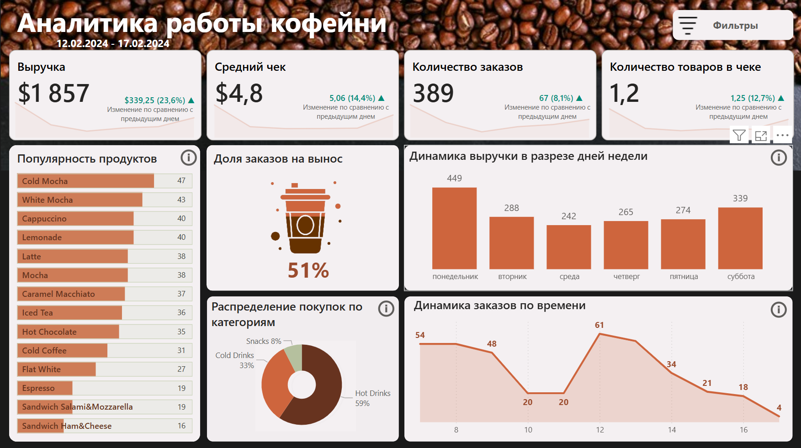
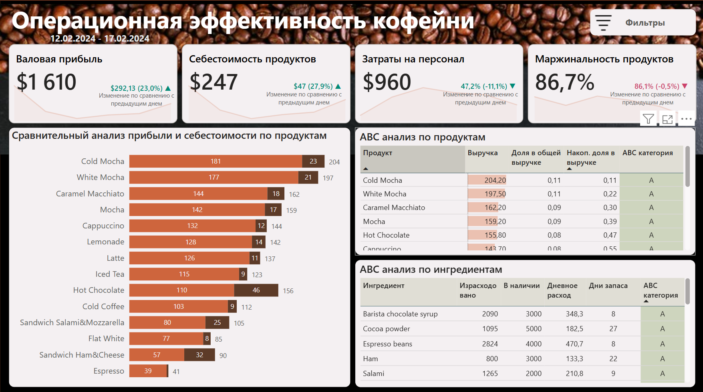

# Coffee Shop Analytics Dashboard ☕

Дашборд для анализа продаж кофейни. Визуализация ключевых метрик: выручка, популярные товары, динамика продаж.

### Аналитика работы кофейни - главный дашборд

### Операционная эффективность

## 📊 Особенности
- **Интерактивные фильтры** (время заказа, категория продукта, тип обслуживания (на вынос/в зале)).
-	**Распределение заказов по времени, категориям и продуктам**
- **ABC-анализ** продуктов и ингредиентов:
  - Категория A: 70% выручки
  - Категория B: 25% 
  - Категория C: 5%
- **Прогноз запасов**: Расчет дней остатка ингредиентов 📆
- **Динамические метки** с цветовой индикацией:
  - ▲ Рост показателя: #018B77
  - ▼ Снижение: #CC426B

## 🛠 Технологии
- **Power BI** (основной инструмент)
- **DAX** (расчетные метрики)
- **Power Query** (первичная обработка)
- **Excel** (исходные данные)

## 📂 Данные
- Источники: Excel-файл (скачан с Kaggle).
- Схема данных: [screenshots/data-model.png]([screenshots/data-model.png).

## 🚀 Запуск
1. Скачайте датасет [CoffeeShop.xlsx](data/CoffeeShop.xlsx). 
2. Скачайте файл [CoffeeShop.pbix](powerbi/CoffeeShop.pbix).
2. Откройте его в Power BI Desktop.
